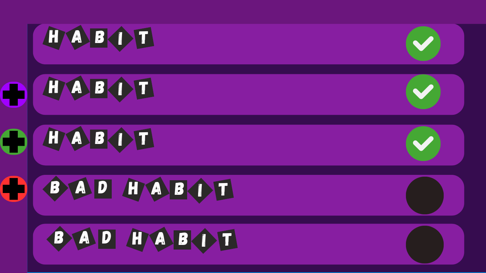
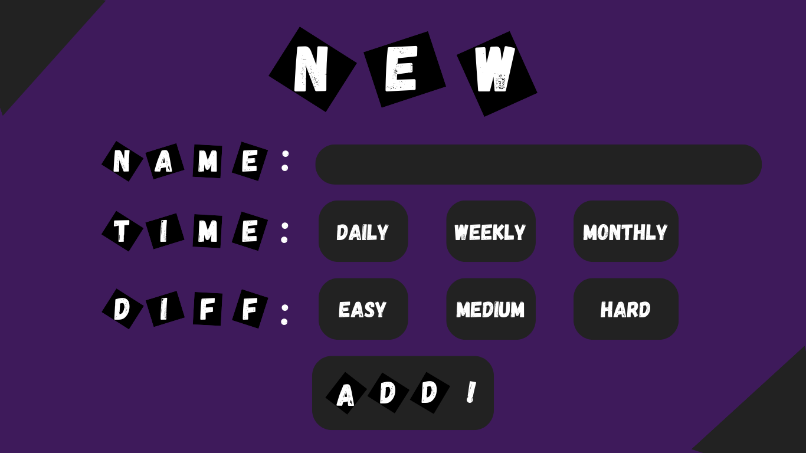

# About
This project aims to make a Habit Tracker to help accomplish goals, keep tabs on all of your good habits, and help getting rid of bad habits, all of this while making it fun.

# Objectives
### Track both good and bad habits.
### Give an incentive to keep doing good habits.
### Discourage bad habits.
### Give you full control on what you want to achieve, or leave behind.

# User histories
I, as a user, want an application that works like a video game, designed to monitor my habits in a fun and interactive way, rewarding me with points or in-game items when I achieve a goal set by myself or by the application.

I want to be able to set my own habits and some goals, and the progress tracking should work with daily and weekly objectives, requiring me to perform or practice an activity for a pre-established number of hours.

The application would make it easier to develop and maintain habits since it is presented as a video game. These habits could benefit my life and health, such as drinking more water.

I want the application to have a main screen displaying the habit and the number of days I have been maintaining it, another module to add habits and set goals, a section for daily and weekly goals along with the total points accumulated, a shop where I can redeem points for rewards, a settings section for account customization, and a profile section.

# Mockups
### This are proofs of concept and not final

The first mockup is the Main page in which there are two functions , first of all the + signs in the left , the purple one adds a new good habit, the green one adds a new task, the red one a new bad habit. The second one is to display the list of habits, both good and bad, and the tasks .These buttons lead to the next mockup in which you can name the habit , put how often you'll do the habit or task, and choose the difficulty.

